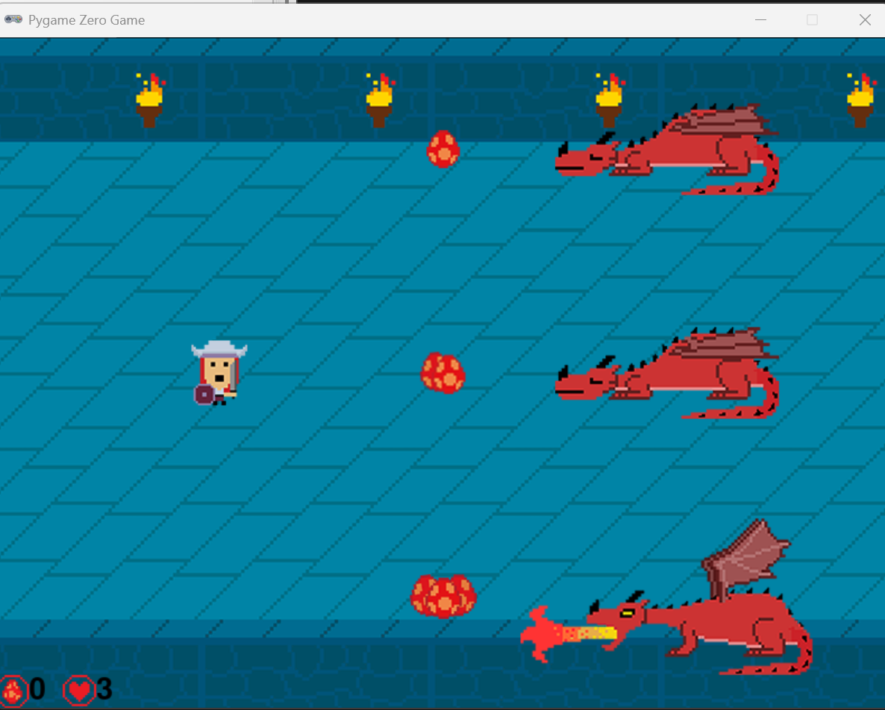

# 🐉 Dragon Egg Game

Welcome to **Dragon Egg Game** — a 2D action-stealth game where your hero attempts to steal dragon eggs from lairs guarded by sleeping (but dangerous!) dragons. Your goal is to collect **20 eggs** without losing all your lives!

## Gameplay

- You control a stealthy hero moving through dragon lairs.
- Dragons periodically wake up and breathe fire — stay out of their attack range!
- Each lair holds 1, 2, or 3 eggs. Grab them while the dragon sleeps.
- If you are caught in the dragon's fire, you'll lose a life.
- **Win the game by collecting 20 eggs** before losing all your lives.

---

## Installation & Setup

### Prerequisites

- Python 3.x
- [`pgzero`](https://pygame-zero.readthedocs.io/) library (for simple game development with Pygame)

### Installation 

git clone https://github.com/Johnmcginnes168/Dragon-Egg-Game.git
cd Dragon-Egg-Game

Install Pygame Zero

pip install pgzero

Run the game with:

pgzrun dragon.py

### Objective

Collect 20 dragon eggs before all 3 lives are lost!

### Developer

John McGinnes
